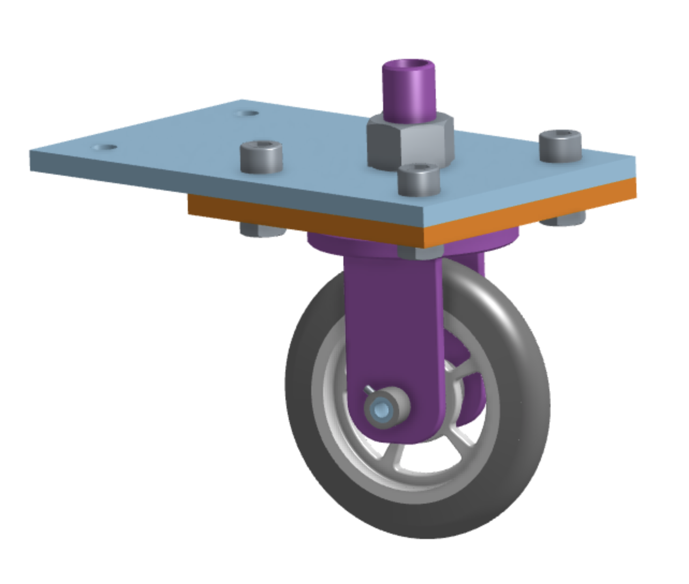

# Caster Assignment
For this assignment, we had to recreate the classic Engineering 1 caster assignmnent, but this time in Onshape instead of Solidworks. We learned all the basics of sketching, extruding, and patterning
## Link to Onshape Document
I made all my parts and assemblies in one Onshape Document found [here](https://cvilleschools.onshape.com/documents/eae5dc97217fca81185a1770/w/6e9210f9cafca1a231e8f307/e/2ec7064764dfcd987c577c06)
## Assembly photo

# Dorothy's Dowel Pins
For this assignment, we learned how to use configurations to make different versions of parts. We then built a picture frame with dowel pins to hold it together.
## Link to Onshape Document
I made all my parts and assemblies in one Onshape Document found [here](https://cvilleschools.onshape.com/documents/8ad1ce960ba6d6a663081bad/w/1790f6fb3c54f1cb8aa6cb15/e/b16635db76a9590d538fda98)
## Assembly photo

# Week 5 challenge: Rotating Cube
For this assignment, we were given the dimensions to a cube, spinner shaft, and brackets. We then had to assemble them in a way that would allow the cube to spin a full 360 degrees and allow the spinner shafts to rotate without any problems.
## Link to Onshape Document
I made all my parts and assemblies in one Onshape Document found [here](https://cvilleschools.onshape.com/documents/accc0d412d0fcbabb3e21e26/w/8e60ddaa4a4fe5a6de1f8d8a/e/cafeeac053986b1c7a17469d)
## Assembly photo

